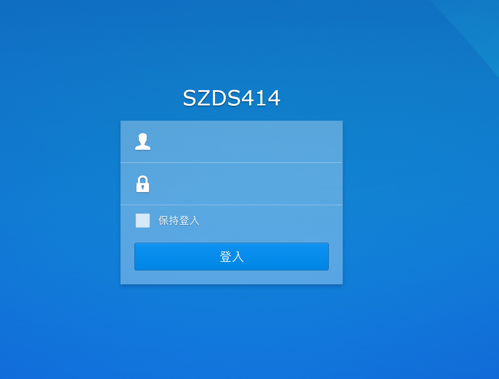
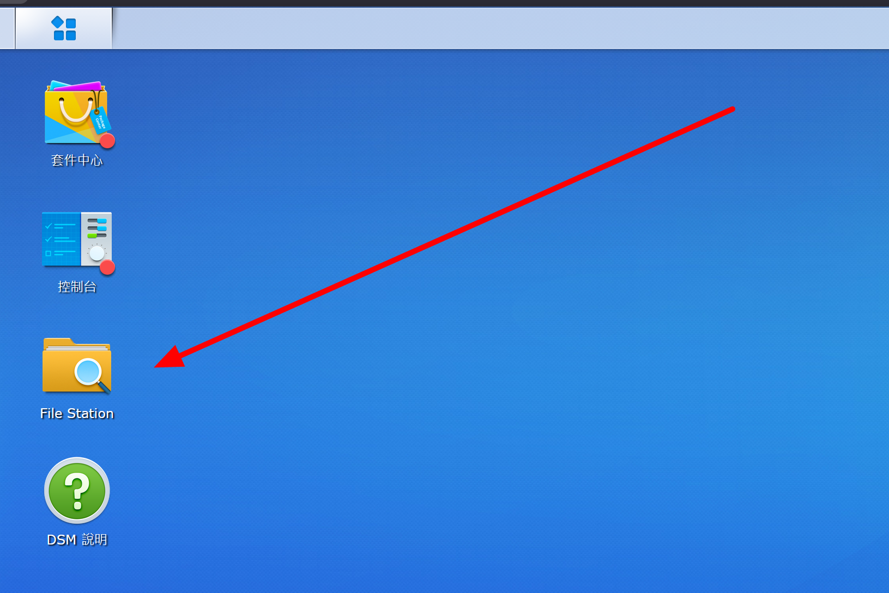
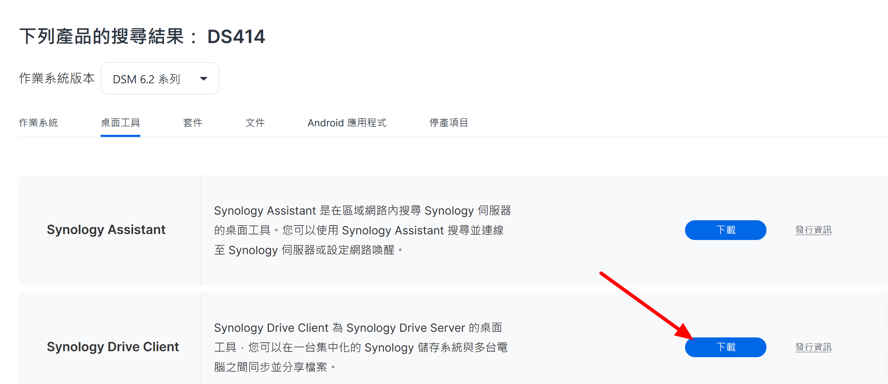
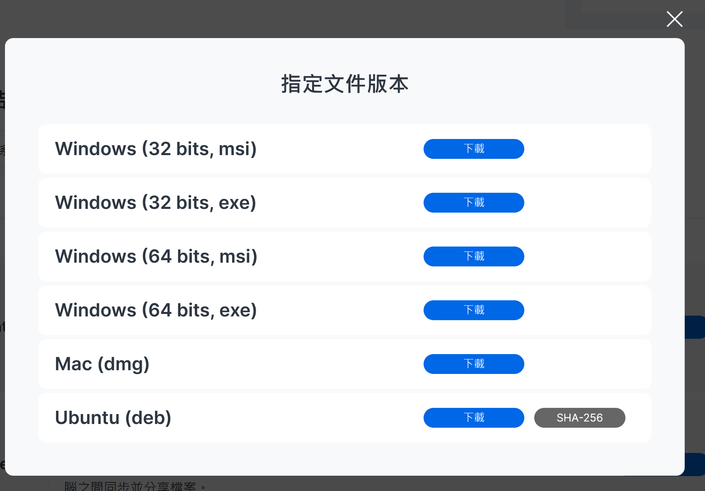
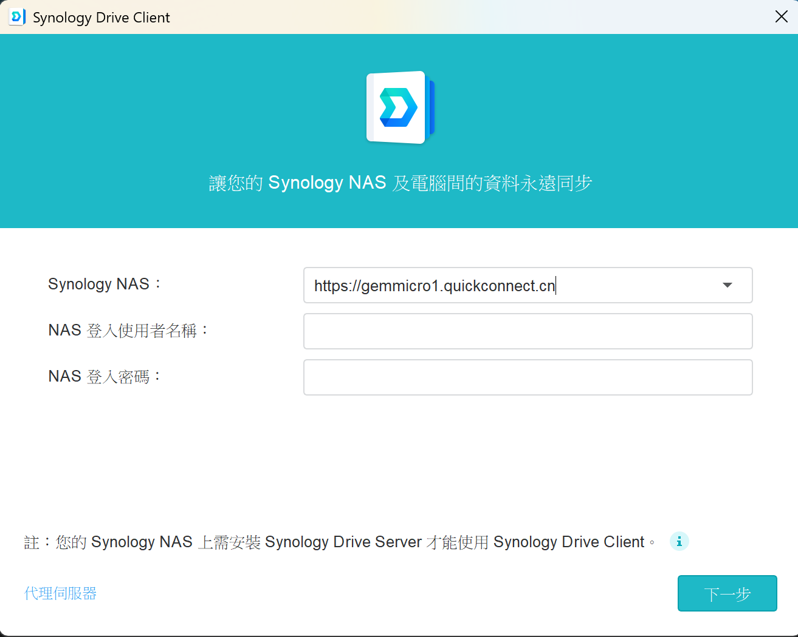
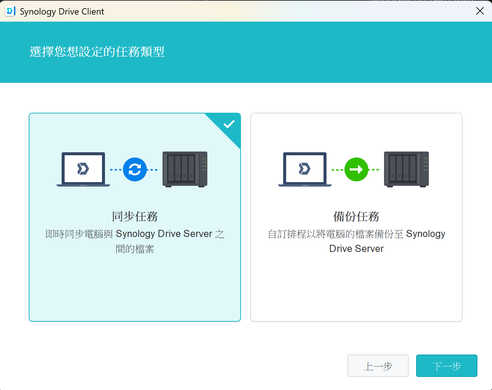
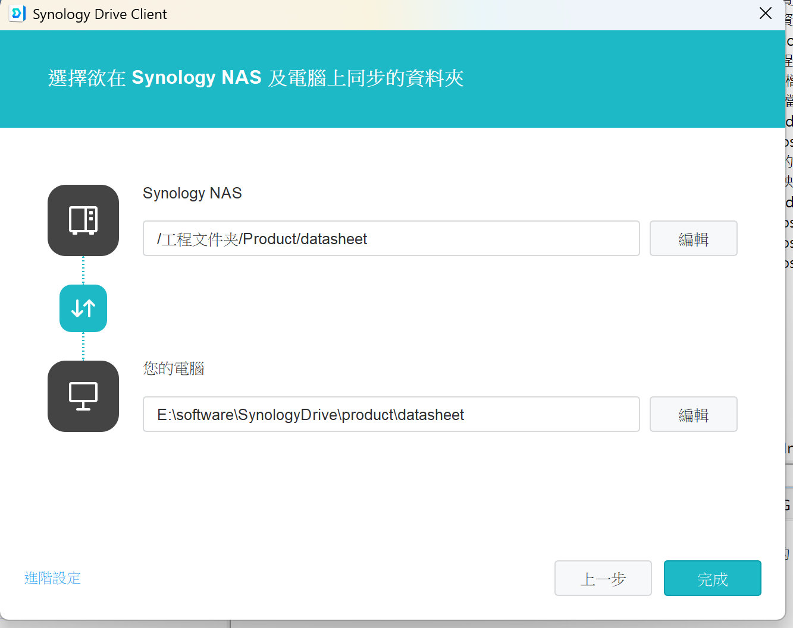
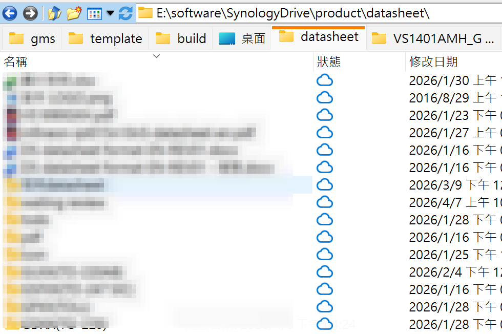

1. 申請帳號: 找jenny申請一組帳號
2. 登入NAS: 
    1. 透過網頁登入
        1. 訪問[NAS 網頁](https://gemmicro1.quickconnect.cn/)並登入帳號
        
        2. 可以在桌面看到資料夾裡面有公司相關資料
        
    2. 透過synology軟體同步 
        1. 到[Synology軟體中心](https://www.synology.com/zh-tw/support/download/DS414?version=6.2#utilities)下載Synology Drive Client (windows可以選第4個)
        
        
        2. 登入帳號(網域: https://gemmicro1.quickconnect.cn)
         
        3. 選擇**同步**，編輯過的檔案才會同步到NAS
         
        4. 設定同步目錄
         
        5. 設定完成，就會自動同步NAS資料下來本地資料夾，以後可以直接在資料夾裡面編輯，儲存後會自動同步
         